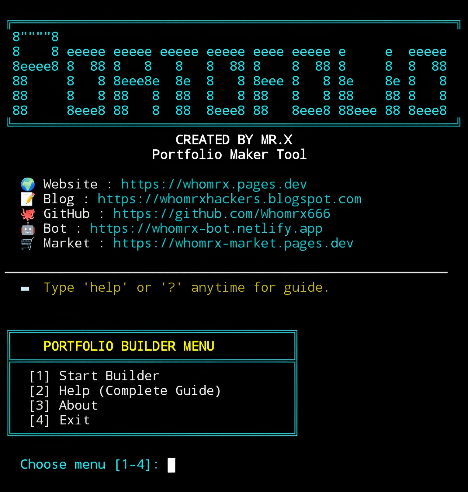

# PORTFOLIO MAKER


<p align="center">
  <strong>Advanced Interactive Portfolio Generator CLI for Termux (No Root)</strong><br>
  <em>"Real Operations: HTML, CSS, SVG, Python. Fully Responsive. — Mr.X"</em>
</p>

## Introduction
**PORTFOLIO MAKER** is a powerful **interactive portfolio generator** designed specifically for mobile and terminal environments. With **10 professional themes**, **10 dynamic backgrounds**, and **6 social media integrations**, it lets you create a stunning personal portfolio website in minutes—all without root access. Built with a sleek **cyberpunk neon terminal interface**, it runs smoothly on **Termux (Android)**, Linux, and any Python-supported platform.

---

## Installation
```bash
$ pkg update -y && pkg upgrade -y
$ pkg install git python -y
$ git clone https://github.com/Whomrx666/Portfolio-maker.git
$ cd Portfolio-maker
$ chmod +x portfolio.py
$ python3 install.py

```
## Run manually
```
$ python3 portofolio.py
```

## Features
- **10 Unique Themes** – Minimal Light, Dark Pro, Ocean Blue, Forest Green, Rose Gold, Sunset Orange, Midnight Purple, Cyberpunk Neon, Tech Noir, Mono Chrome.
- **10 Background Styles** – Gradients, animated rainbow, cyberpunk grid, dot patterns, and more.
- **Interactive Step by Step Wizard** – Easily input name, title, skills, projects, testimonials, and social links.
- **Termux Optimized** – Fully functional on Android with no root required.
- **Cyberpunk UI** – Neon-themed terminal with animated boot screen, menu, and clean output formatting.
- **Responsive HTML Export** – Generates a modern, Mobile friendly portfolio ready for GitHub Pages, Netlify, or Vercel.
- **Custom Header Background** – Upload your own image to the header.
- **Colorful Skill Cards** – Pick custom emojis from a built in menu for each skill.
- **SVG Social Icons** – Professional icons for Instagram, Facebook, X, TikTok, Telegram, WhatsApp, Email, LinkedIn, GitHub, and Website.
- **Typewriter Animation** – Your name types out smoothly on the generated page.
- **Scroll Animations** – Sections fade and slide into view as you scroll.
- **Local & Public Server** – Preview instantly on localhost or share a temporary public URL via SSH tunnel (localhost.run, no token needed).
- **Custom Save Location & Filename** – Choose exactly where to save the HTML file.
· Help System – Type help or ? at any prompt for a complete guide.

## Instructions
- **First**: Install the tool using the commands above.
- **Second**: Run python3 portfolio.py to launch the cyberpunk interface.
- **Third**: Select [1] Start Builder, [2] Help, [3] About, or [4] Exit.
- **Fourth**: Follow the 6step wizard – enter your info, skills (with emojis), projects, testimonials, contacts, theme, and background.
- **Fifth**: Your portfolio HTML will be generated and saved to your chosen folder.
- **Last**: Optionally start a web server to preview locally or get a public link to share.

## Observation
This tool is intended for **educational and ethical hacking purposes only**. Unauthorized scanning of systems you do not own or have explicit permission to test is illegal. The author assumes no responsibility for misuse or damage caused by this tool.

### Original Author
<a href="https://github.com/Whomrx666"></a>

### <<< If you copy , Then Give me The Credits >>>

## CONNECT WITH ME :

[](https://whomrxhackers.blogspot.com/)
[](https://twitter.com/whomrx666)
[](https://wa.me/6285926601133?text=Halo%2C%20Mr.X)
[](https://www.facebook.com/whomrx.666)
[](https://t.me/Whomr_X)
[](mailto:whomrx666@gmail.com)
[](https://www.tiktok.com/@whomr.x)

**If you want to donate, click on the button**
<a href="https://saweria.co/whomrx"></a>

---

<p align="left">
  
</p>